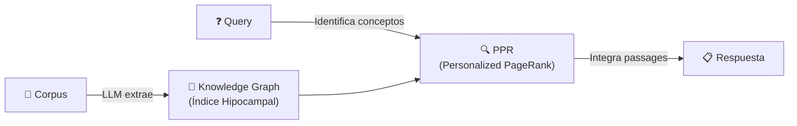
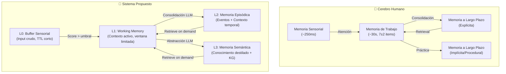
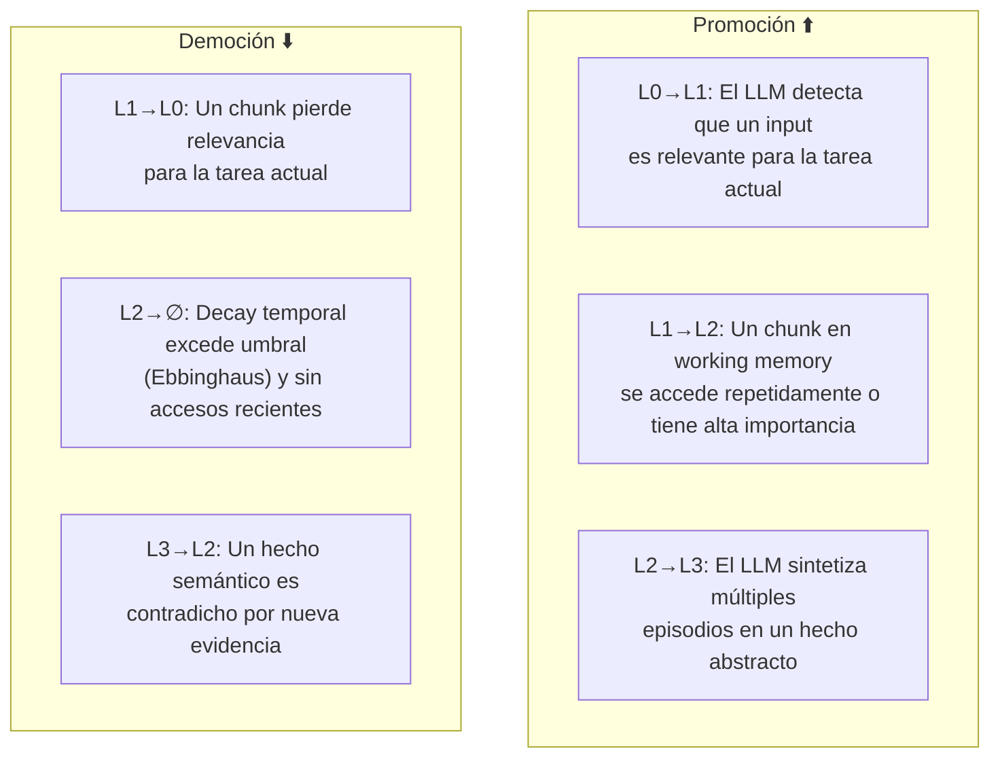
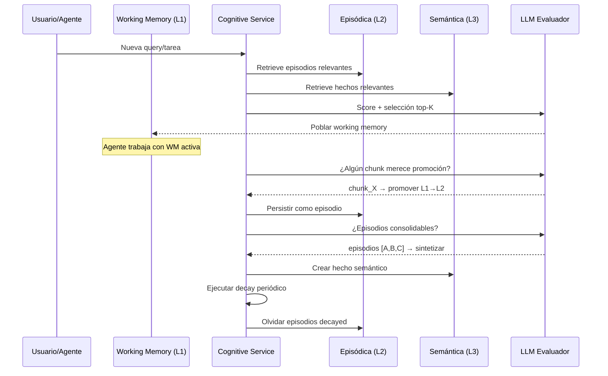

# 🧠 Investigación: Gestión Cognitiva de Memorias por LLM

## Resumen Ejecutivo

**¿Es viable?** Sí, absolutamente. La investigación actual (2024-2026) demuestra múltiples implementaciones funcionales donde LLMs administran memorias de forma jerárquica, promoviendo/demotando información entre niveles según contexto y relevancia. El campo está en plena madurez con papers de NeurIPS, ICLR, y frameworks open-source de producción.

---

## 1. Estado del Arte — Papers Clave

### 1.1 H-MEM: Hierarchical Memory for LLM Agents
> **arXiv:2507.22925** (Jul 2025) — Sun & Zeng

Arquitectura multi-nivel donde cada vector de memoria se embebe con un **encoding de índice posicional** que apunta a sub-memorias semánticamente relacionadas en la capa siguiente. Un mecanismo de **routing basado en índices** permite recuperación capa-por-capa sin cómputo exhaustivo de similaridad.

| Aspecto | Detalle |
|---------|---------|
| Niveles | Multi-nivel por abstracción semántica |
| Routing | Índice posicional → sub-memorias |
| Evaluación | LoCoMo dataset, supera 5 baselines |
| Relevancia | Directamente aplicable a promoción/democión por nivel de abstracción |

---

### 1.2 MemTree: Dynamic Tree Memory Representation
> **arXiv 2025**

Representación de memoria en **árbol dinámico** donde los nodos encapsulan contenido textual agregado + embeddings semánticos. Maneja razonamiento complejo e interacciones extendidas organizando jerárquicamente.

```
          [Raíz: Resumen Global]
         /          |           \
   [Tema A]     [Tema B]     [Tema C]
   /     \        |          /    \
[Detalle] [Detalle] [Detalle] [Detalle] [Detalle]
```

---

### 1.3 CoALA: Cognitive Architectures for Language Agents
> **TMLR 2024** — Sumers, Yao, Narasimhan, Griffiths (Princeton)

Framework canónico que categoriza la memoria de agentes LLM en tipos cognitivos:

| Tipo de Memoria | Análogo Humano | Implementación LLM |
|-----------------|----------------|---------------------|
| **Working Memory** | Atención consciente | Context window / scratchpad |
| **Episódica** | "¿Qué pasó ayer?" | Logs de interacciones pasadas |
| **Semántica** | "Los pájaros vuelan" | Knowledge base / grafos de conocimiento |
| **Procedural** | "Cómo andar en bici" | Skills / código / parámetros del modelo |

> [!IMPORTANT]
> CoALA es el framework teórico más citado. Define el vocabulario y las categorías que la mayoría de implementaciones posteriores adoptan.

---

### 1.4 MemoryBank: LLM + Curva de Olvido de Ebbinghaus
> **AAAI 2024**

Mecanismo de memoria dinámica inspirado en la **curva de olvido de Ebbinghaus**: las memorias decaen con el tiempo a menos que se refuercen. El LLM decide qué memorias reforzar y cuáles dejar decaer.

```
Fuerza de Memoria
     │
100% ┤ ██
     │ ██ ██
     │ ██ ██ ░░░░░  ← Decaimiento natural
     │ ██ ██ ░░░░░ ██ ← Refuerzo (promoción)
  0% └──────────────────→ Tiempo
```

**Mecanismo clave**: El LLM evalúa cada memoria con un score combinado de `recencia × importancia × relevancia_contextual`, y actualiza dinámicamente el "peso" de cada recuerdo.

---

### 1.5 HippoRAG: Inspiración Hipocampal para LLMs
> **NeurIPS 2024** — arXiv:2405.14831

Imita la **teoría del índice hipocampal** de la memoria humana a largo plazo:



- **Neocórtex artificial** = LLM que procesa y transforma documentos
- **Hipocampo artificial** = Knowledge Graph sin esquema
- **Recuperación** = Personalized PageRank sobre el KG
- **Resultado**: 20% mejor que SOTA RAG en multi-hop QA, 10-30x más barato que retrieval iterativo

---

### 1.6 SYNAPSE: Spreading Activation para Memoria Episódica-Semántica
> **arXiv 2026**

Grafo dinámico unificado que fusiona nodos episódicos (interacciones) con nodos semánticos (conceptos abstractos). Usa **spreading activation** (propagación de activación) + **inhibición lateral** + **decaimiento temporal** para resaltar subgrafos relevantes dinámicamente.

> [!TIP]
> SYNAPSE es el paper más reciente y sofisticado. Su modelo de spreading activation es directamente análogo a cómo las neuronas del cerebro seleccionan memorias relevantes.

---

### 1.7 Generative Agents: Simulacra of Human Behavior
> **UIST 2023 / arXiv:2304.03442** — Park et al. (Stanford)

El paper seminal que demostró que agentes con LLM pueden mantener memorias creíbles usando un **memory stream** y un modelo de recuperación basado en tres factores:

```
Score(memoria) = α × Recencia + β × Importancia + γ × Relevancia
```

- **Recencia**: Exponential decay por tiempo
- **Importancia**: El LLM puntúa 1-10 qué tan significativo es el evento
- **Relevancia**: Cosine similarity entre embedding de la memoria y la query actual
- **Reflexión**: Memorias de "segundo orden" — abstracciones que sintetizan múltiples memorias base

---

## 2. Repos y Frameworks Open-Source

| Repo | Descripción | Relevancia |
|------|-------------|------------|
| [**mem0ai/mem0**](https://github.com/mem0ai/mem0) | Capa de memoria universal: User/Session/Agent con vector+KV+graph DBs. Scoring por relevancia/importancia/recencia. | ⭐⭐⭐⭐⭐ Producción |
| [**LangChain Memory**](https://github.com/langchain-ai/langchain) | Módulos de memoria: Buffer, Summary, Entity, KG memory | ⭐⭐⭐⭐ Framework |
| [**LlamaIndex**](https://github.com/run-llama/llama_index) | Índices jerárquicos: Tree, List, KG, Vector store | ⭐⭐⭐⭐ Framework |
| [**HippoRAG**](https://github.com/OSU-NLP-Group/HippoRAG) | KG + PPR para memoria a largo plazo neurobiológica | ⭐⭐⭐⭐ Research |
| [**Hierarchical-RAG**](https://github.com/unstablebrainiac/Hierarchical-RAG) | Topic modeling jerárquico sin vectorización | ⭐⭐⭐ Research |
| [**MemOS/MemTensor**](https://github.com/MemTensor/MemOS) | OS de memoria para agentes: persistent skill memory | ⭐⭐⭐ Experimental |

---

## 3. Analogía Cerebro Humano ↔ Sistema Propuesto



---

## 4. Diseño Propuesto: "Cerebro Cognitivo" para MCP-RAG

### 4.1 Arquitectura de 4 Niveles de Memoria

```
┌─────────────────────────────────────────────────────────────┐
│                    CEREBRO COGNITIVO                         │
├─────────────────────────────────────────────────────────────┤
│  L0 ─ BUFFER SENSORIAL                                     │
│  • Inputs crudos del contexto actual                        │
│  • TTL: duración de la sesión                               │
│  • Capacidad: ilimitada (FIFO con ventana)                  │
│  • Sin embedding, solo texto crudo                          │
├─────────────────────────────────────────────────────────────┤
│  L1 ─ WORKING MEMORY (Memoria de Trabajo)                  │
│  • Chunks relevantes para la tarea actual                   │
│  • Capacidad: N slots (configurable, default ~20)           │
│  • Embeddings activos + scores de activación                │
│  • Se refresca por cada nueva query/tarea                   │
├─────────────────────────────────────────────────────────────┤
│  L2 ─ MEMORIA EPISÓDICA                                    │
│  • Eventos + interacciones con contexto temporal            │
│  • Decay por curva de Ebbinghaus                            │
│  • metadata: timestamp, importancia, accesos, contexto      │
│  • Embeddings persistidos en vector store                   │
├─────────────────────────────────────────────────────────────┤
│  L3 ─ MEMORIA SEMÁNTICA (Knowledge Graph)                  │
│  • Conocimiento destilado y abstracto                       │
│  • Grafos de relaciones entity→entity                       │
│  • Hechos consolidados (sin temporalidad)                   │
│  • Máxima compresión, máxima permanencia                    │
└─────────────────────────────────────────────────────────────┘
```

### 4.2 Mecanismo de Promoción/Democión

El LLM actúa como **"corteza prefrontal"** que evalúa y mueve memorias entre niveles:



#### Score de Memoria (inspirado en Generative Agents + MemoryBank):

```python
def memory_score(memory, query, current_time):
    recency = exp(-λ * (current_time - memory.last_access))
    importance = memory.importance_score  # LLM-assigned 0-1
    relevance = cosine_similarity(embed(query), memory.embedding)
    access_frequency = log(1 + memory.access_count)

    return (
        w_recency * recency +
        w_importance * importance +
        w_relevance * relevance +
        w_frequency * access_frequency
    )
```

#### Reglas de Transición:

| Transición | Trigger | Acción del LLM |
|------------|---------|-----------------|
| L0 → L1 | `relevance(input, task) > θ_promote_L1` | Evalúa si el input es útil para la tarea actual |
| L1 → L2 | `access_count > N` ∨ `importance > θ_consolidate` | Marca como episodio con metadata temporal |
| L2 → L3 | Acumulación de K episodios similares | Sintetiza en un "hecho" abstracto vía prompt |
| L1 → L0 | `relevance < θ_demote` en re-evaluación | Libera slot de working memory |
| L2 → ∅ | `ebbinghaus_decay(t) < θ_forget` | Olvido natural, opcionalmente archiva |
| L3 → L2 | Nueva evidencia contradice el hecho | Revierte a episodios para re-evaluación |

### 4.3 Integración con Arquitectura Hexagonal Existente

El diseño se integra al MCP-RAG actual como **nuevos ports y adapters**:

```
cerebro_python/
├── domain/
│   ├── models.py              # + MemoryRecord, MemoryLevel, CognitiveScore
│   └── ports.py               # + CognitiveMemoryPort, MemoryPromoterPort
├── application/
│   └── cognitive_service.py   # [NEW] Orquestador de promoción/democión
├── adapters/
│   ├── cognitive/             # [NEW]
│   │   ├── memory_scorer.py   # Scoring multi-factor (rec+imp+rel+freq)
│   │   ├── level_manager.py   # Gestión de transiciones entre niveles
│   │   ├── consolidator.py    # L2→L3: síntesis episódica→semántica
│   │   └── decay_engine.py    # Ebbinghaus decay automático
│   └── storage/
│       └── sqlite_repo.py     # Extender con tabla memory_levels
```

#### Nuevos Ports Propuestos:

```python
class CognitiveMemoryPort(Protocol):
    """Puerto para gestión cognitiva de memorias."""
    def score_memory(self, memory: MemoryRecord, query: str) -> CognitiveScore: ...
    def evaluate_promotion(self, memory: MemoryRecord) -> MemoryLevel | None: ...
    def evaluate_demotion(self, memory: MemoryRecord) -> MemoryLevel | None: ...
    def consolidate(self, episodes: list[MemoryRecord]) -> MemoryRecord: ...

class MemoryLevelPort(Protocol):
    """Puerto para operaciones por nivel."""
    def get_by_level(self, level: MemoryLevel) -> list[MemoryRecord]: ...
    def transition(self, memory_id: str, from_level: MemoryLevel, to_level: MemoryLevel) -> bool: ...
    def apply_decay(self, cutoff_time: datetime) -> int: ...
```

### 4.4 Flujo de Operación



### 4.5 Config via Variables de Entorno (estilo MCP-RAG existente)

```bash
# Cognitive Memory Settings
RAG_COGNITIVE_ENABLED=true
RAG_COGNITIVE_WM_SLOTS=20
RAG_COGNITIVE_PROMOTE_L1_THRESHOLD=0.6
RAG_COGNITIVE_CONSOLIDATE_THRESHOLD=0.75
RAG_COGNITIVE_FORGET_THRESHOLD=0.15
RAG_COGNITIVE_DECAY_LAMBDA=0.02
RAG_COGNITIVE_RECENCY_WEIGHT=0.25
RAG_COGNITIVE_IMPORTANCE_WEIGHT=0.30
RAG_COGNITIVE_RELEVANCE_WEIGHT=0.35
RAG_COGNITIVE_FREQUENCY_WEIGHT=0.10
RAG_COGNITIVE_CONSOLIDATION_MIN_EPISODES=3
RAG_COGNITIVE_DECAY_INTERVAL_HOURS=24
```

---

## 5. Viabilidad y Riesgos

### ✅ Factores a Favor

| Factor | Evidencia |
|--------|-----------|
| **Arquitectura probada** | H-MEM, MemTree, CoALA, SYNAPSE demuestran viabilidad |
| **Frameworks existentes** | Mem0, LangChain Memory ya ofrecen multi-nivel en producción |
| **Scoring funcional** | Generative Agents (Stanford) valida el scoring recency+importance+relevance |
| **Base neurobiológica** | HippoRAG demuestra que imitar el hipocampo mejora retrieval 20% |
| **Compatible con hexagonal** | Ports+adapters permite agregar sin romper lo existente |

### ⚠️ Riesgos y Mitigaciones

| Riesgo | Mitigación |
|--------|------------|
| **Costo de LLM calls** para scoring | Usar scoring local (sin LLM) para recency/frequency; LLM solo para importance y consolidación |
| **Latencia** en promoción/democión | Ejecutar transiciones de forma asíncrona/batch |
| **Drift semántico** al consolidar L2→L3 | Validar hechos semánticos contra episodios fuente |
| **Complejidad de thresholds** | Comenzar con defaults conservadores, ajustar con métricas |
| **Almacenamiento** de múltiples niveles | Reutilizar SQLite con tabla particionada por nivel |

---

## 6. Conclusión

La gestión cognitiva de memorias por LLM no solo es viable — es la **dirección principal** de la investigación actual en agentes inteligentes. El diseño propuesto "Cerebro Cognitivo" para MCP-RAG:

1. **Se basa en 7+ papers de venues top** (NeurIPS, AAAI, ICLR, TMLR, UIST)
2. **Reutiliza la arquitectura hexagonal existente** sin refactoring masivo
3. **Es configurable** por env vars como el resto del proyecto
4. **Escala gradualmente** — se puede implementar L0+L1 primero, luego L2, luego L3
5. **Simula fielmente** el modelo cognitivo humano de selección de memorias

El siguiente paso sería crear un **implementation plan** detallado si se desea proceder con el desarrollo.

---

## Referencias

1. Sun & Zeng. "H-MEM: Hierarchical Memory for High-Efficiency Long-Term Reasoning in LLM Agents." arXiv:2507.22925, 2025.
2. "MemTree: From Isolated Conversations to Hierarchical Schemas: Dynamic Tree Memory Representation for LLMs." arXiv, 2025.
3. Sumers, Yao, Narasimhan, Griffiths. "Cognitive Architectures for Language Agents (CoALA)." TMLR, 2024.
4. "MemoryBank: Enhancing Large Language Models with Long-Term Memory." AAAI, 2024.
5. "HippoRAG: Neurobiologically Inspired Long-Term Memory for Large Language Models." NeurIPS, 2024. arXiv:2405.14831.
6. "SYNAPSE: Empowering LLM Agents with Episodic-Semantic Memory via Spreading Activation." arXiv, 2026.
7. Park et al. "Generative Agents: Interactive Simulacra of Human Behavior." UIST 2023. arXiv:2304.03442.
8. Mem0: Memory Layer for AI Agents. github.com/mem0ai/mem0.
9. "RAG-Driven Memory Architectures in Conversational LLMs." 2025.
10. "RAHL: Retrieval-Augmented Hierarchical Reinforcement Learning." arXiv, 2025.
